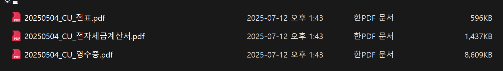
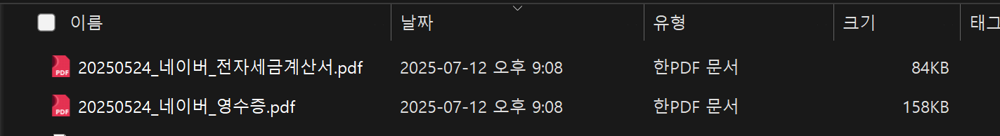

# 파일 여러 개 추가하여 동시에 이름 변경하는 프로그램

## js
#### 결과물 (첫 번째)
```
1. I need to be able to add multiple files
2. Each file has properties (receipt, statement of account, electronic tax invoice) .. This text is easy to edit
3. When I press the button once, the name of this file changes to the same and the properties and file name are the same after that. (ex 20251040_mac_receipt.pdf)
```


1. 문제점
 - 파일이 한 개만 지정되었다. 파일의 갯수가 시시각각 변하기 때문에 원할 떄 마다 갯수를 변경하고 싶었다.
 - 영어로 명령을 내리다 보니 번역한 언어가 이상하게 번역되었다. (이 부분은 원하는 항목은 한글로 강조할 예정)
 - 파일명이 내가 지정하는 게 아닌 예시로 지정한 것으로 고정되었다.


#### 결과물 (두 번째)
 ```
 Okay, well done. But it's not the result I want.

1. I should be able to write the file name myself. Add a text line so I can write it.
2. The number of files should increase when I click the "Add" button in the UI so that the number of files that can be attached increases.
3. Change the format of the combo box to "Transaction Statement", "Voucher", "Receipt", "Electronic Tax Invoice", "Capture", and also write a manual.txt so that I can add it when I want.
 ```





#### 결론
 - 잘 사용해보지도 않고 거의 몰랐던 js, html, css 를 가지고 이 프로젝트는 진행하였다면 거의 1 ~ 2일이라는 시간이 소요되었을 것으로 예상된다. 하지만 gemimi cli를 사용하여 30분이라는 시간도 되지 않아 프로젝트가 완성되었다.

## Python
 - html을 잘 몰라 유지보수가 될 거 같지도 않아서 제일 잘하는 파이썬으로 제작해보기로 하였다. js만큼의 직관성은 떨어지지만 기존 내가 불편하다고 생각했던 부분도 추가해서 cli를 작성하였다. 대략 3번 정도의 작성으로 프로그램이 완성되었고 이번에는 플로차트와 기능 내역서도 작성을 부탁하였다. 다음번에 기능 요구사항 내역서를 작성하여 프로그램을 제작할 예정이다.




