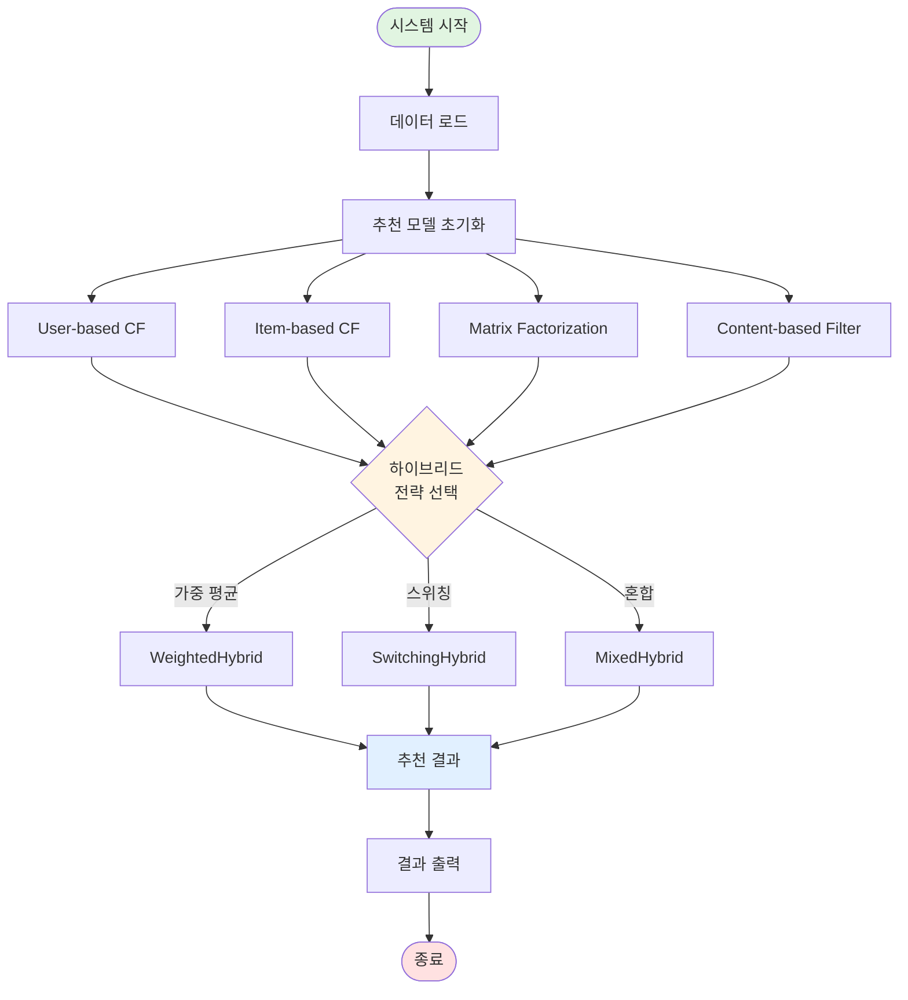
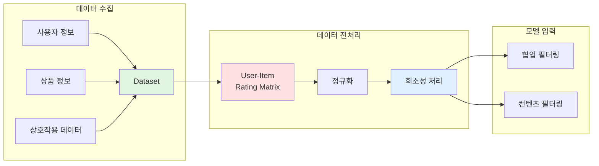
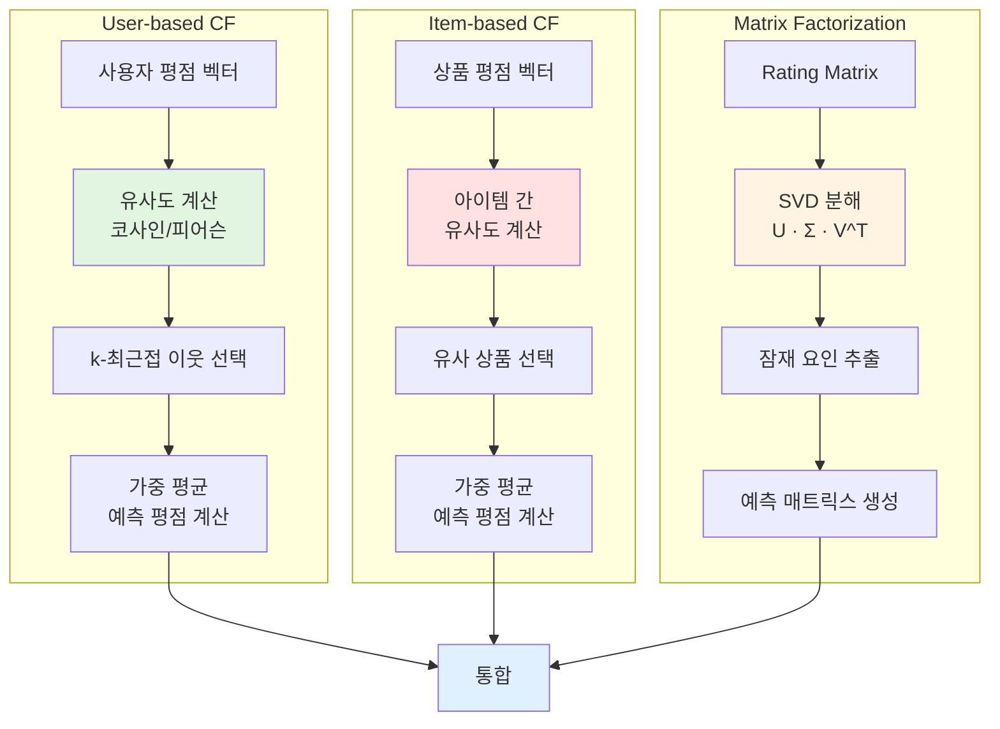
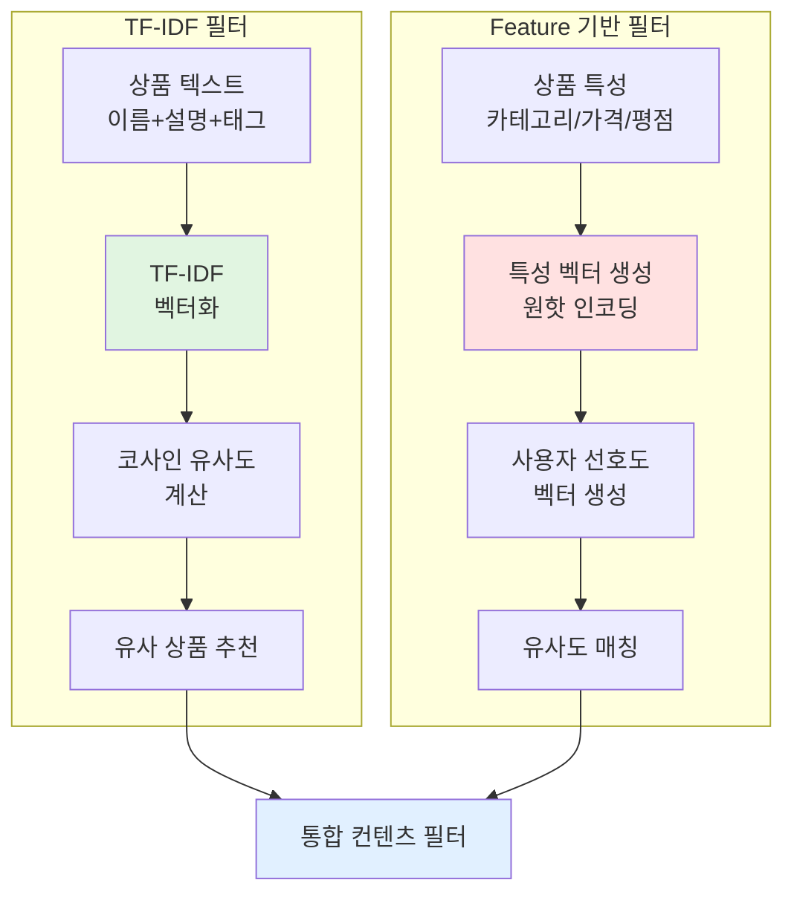
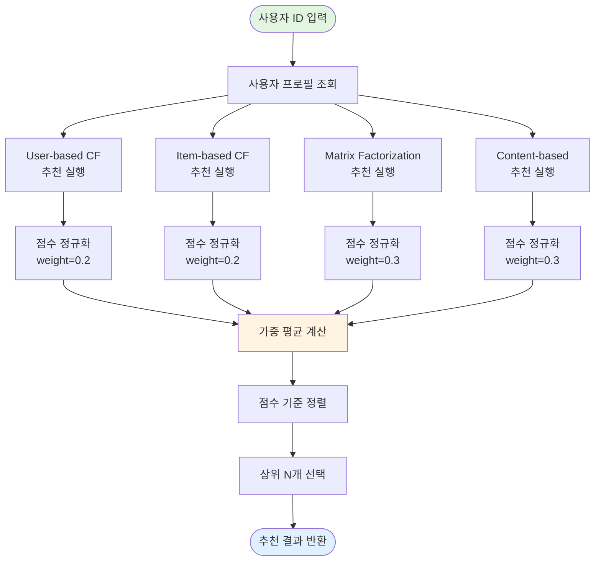
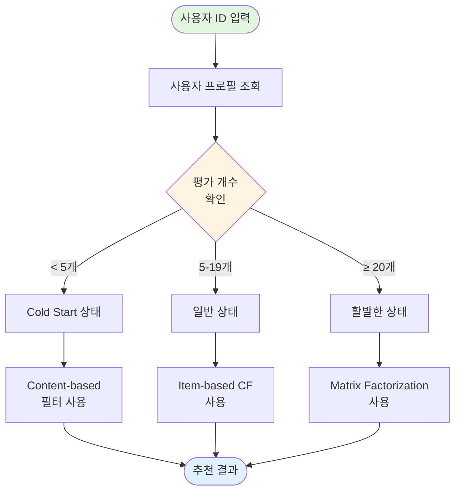
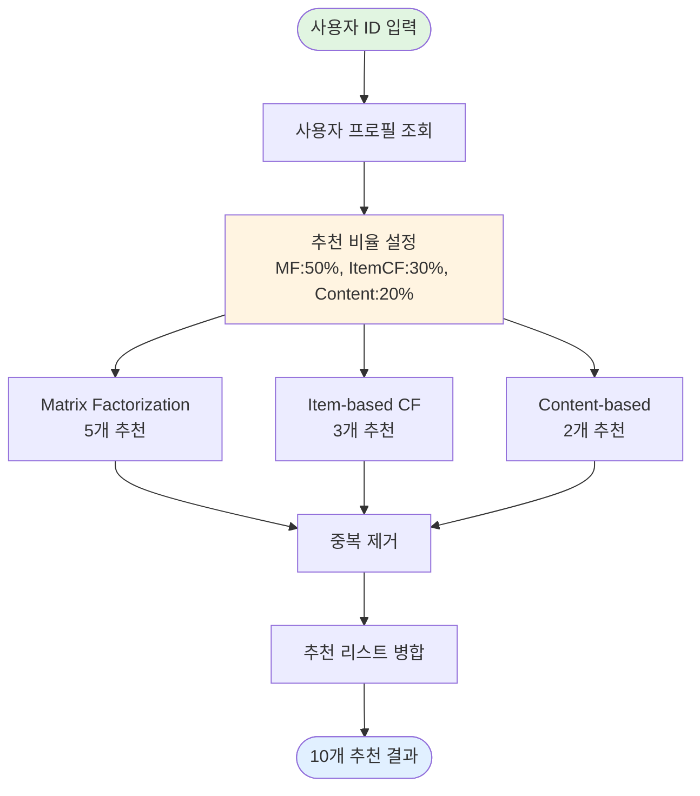
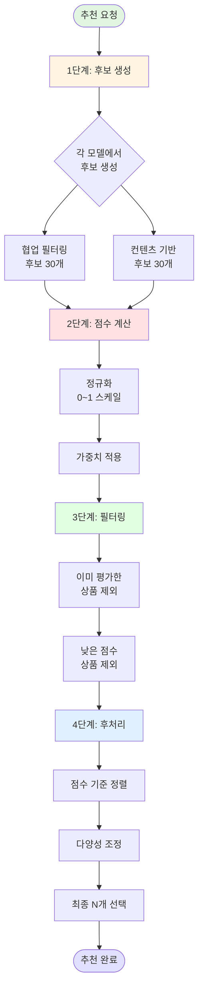
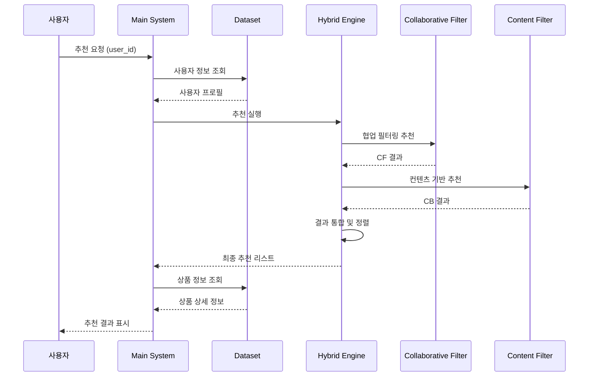
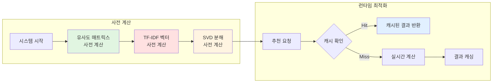

# 하이브리드 추천 시스템 흐름도

## 전체 시스템 아키텍처

## 데이터 처리 흐름

## 협업 필터링 처리 흐름

## 컨텐츠 기반 필터링 흐름

## 가중 평균 하이브리드 추천 흐름

## 스위칭 하이브리드 추천 흐름

## 혼합 하이브리드 추천 흐름

## 추천 결과 생성 상세 흐름

## 시스템 실행 시퀀스

## 성능 최적화 흐름

